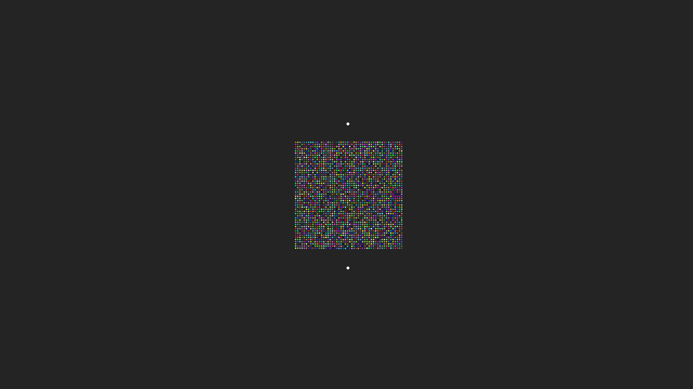
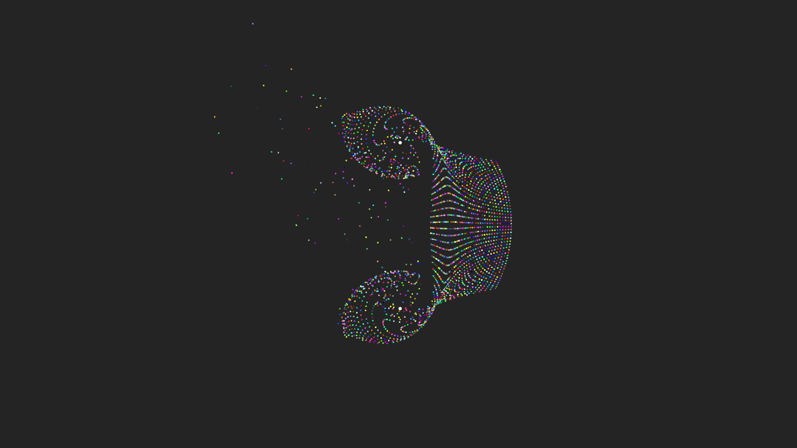
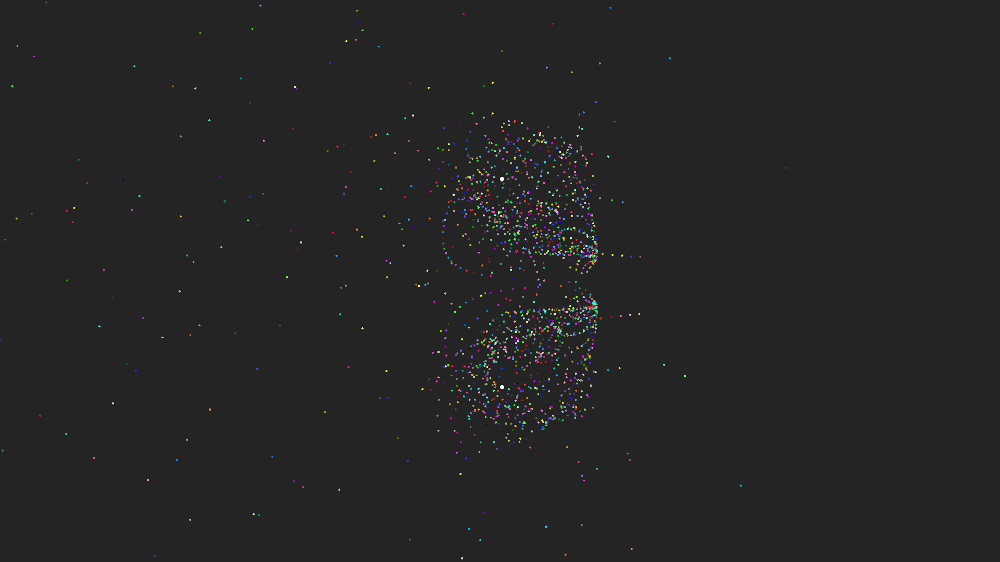

# SFML Gravity Simulation

This is a gravity simulation using Newton's Laws that was created in C++ and rendered using [SFML](https://www.sfml-dev.org/).

<!-- show image -->

# Usage

To run the simulation, you can download from the releases page or build from the source code.

When you launch the simulation, you will be presented with a window that is completely still and nothing happens. To start/stop the simulation, press the `Spacebar` key.

If you want to zoom into/out of the simulation, scroll in/out with the mouse wheel. To pan around the simulation, hold down the `Left Mouse Button` and drag the mouse.

To exit the program, press the `Escape` key.

# Edit the simulation

To make edits to the simulation, launch the `SFML Tutorial.sln` solution file and open in Visual Studio 2019. From here open the `SFML Tutorial.cpp` file and start editing 🚀
